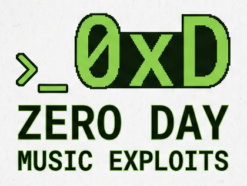

  

<h1 align="center">ZERO DAY · MUSIC EXPLOITS</h1>

<strong>Laboratorio de instrumentos web · 100% client-side · sin backend</strong>

  <a href="https://zeroday-musicexploits.github.io/instruments/">Sitio web</a> ·
  <a href="#cómo-usar-cualquiera-de-los-5">Cómo se usa</a> ·
  <a href="#compatibilidad">Compatibilidad</a>

Zero Day · Music Exploits es una suite de 5 instrumentos musicales que corren enteramente en el navegador — sin servidor, sin cuentas, sin conexión requerida una vez cargados. Cada uno es un archivo HTML autocontenido, pensado para tocarse con teclado de PC, mouse, dedo (tablet/touch) o MIDI, y para funcionar como un laboratorio de sonido completo: se puede tocar, programar, grabar, exportar y guardar todo lo hecho.

Los 5 instrumentos se pueden usar de forma independiente, y también se pueden sincronizar, mezclar y masterizar juntos desde **C2 · Sync Master Envelopment**, la plataforma central del proyecto (cada instrumento se abre ahí como una pestaña, con tempo compartido y encendido/apagado conjunto).

| # | Instrumento | Archivo | Tipo |
|---|---|---|---|
| 1 | **CronBeat-8:08** | `CronBeat-808.html` | Caja de ritmos / drum machine |
| 2 | **MonoMoon'70** | `MonoMoon70.html` | Sintetizador monofónico estilo Minimoog |
| 3 | **NEBULARP 2035** | `Nebularp_2035.html` | Arpegiador cósmico / generativo |
| 4 | **J4-Sirens Station** | `J4-Sirens_Station.html` | Dub siren psicodélica |
| 5 | **ACID BASS-303** | `Acid_Bass-303.html` | Bajo ácido tipo TB-303 |

## Índice

- [1 · CronBeat-8:08 — Caja de ritmos](#1--cronbeat-808--caja-de-ritmos)
- [2 · MonoMoon'70 — Sintetizador monofónico](#2--monomoon70--sintetizador-monofónico)
- [3 · NEBULARP 2035 — Arpegiador cósmico](#3--nebularp-2035--arpegiador-cósmico)
- [4 · J4-Sirens Station — Dub siren](#4--j4-sirens-station--dub-siren)
- [5 · ACID BASS-303 — Bajo ácido](#5--acid-bass-303--bajo-ácido)
- [C2 · Sync Master Envelopment](#c2--sync-master-envelopment)
- [Compatibilidad](#compatibilidad)
- [Privacidad](#privacidad)
- [Nombres oficiales de archivo](#nombres-oficiales-de-archivo)

## Cómo usar cualquiera de los 5

1. Abrí el archivo `.html` directamente en el navegador (doble clic, o arrastrarlo a una pestaña). No requiere instalación ni servidor.
2. La primera interacción (clic, tap o tecla) desbloquea el audio del navegador — vas a ver un aviso tipo "Pulsá para encender" / "Tocá para encender". Es un requisito de los navegadores modernos, no un bug.
3. Todos los instrumentos son instalables como **PWA** (app web progresiva): el navegador va a ofrecer "Instalar app" para tenerlos como ícono aparte, usables sin conexión.
4. El trabajo (patrones, patches, presets, arreglos) se **autoguarda en el navegador** (localStorage / IndexedDB, según el instrumento). Si limpiás datos del navegador o cambiás de navegador/dispositivo, se pierde — por eso cada uno tiene export/import a JSON.
5. Para llevarte el audio afuera: cada uno exporta a **WAV**, y los secuenciados (CronBeat, Acid Bass) también exportan/importan **MIDI**.

---

## 1 · CronBeat-8:08 — Caja de ritmos

*"Machine Drum lab"*

### Qué es
Una caja de ritmos completa: secuenciador de patrones tocable en vivo, banco de pads con samples propios, editor de sample no destructivo, cadena de efectos por pista, modo canción y exportación a WAV/MIDI. Pensada para sonar bien desde el primer patrón y funcionar como laboratorio de sonido a la vez.

<strong>Manual de usuario completo</strong>

### Pestañas principales
- **Secuenciador** — programación de patrones.
- **Pads en vivo** — tocar los pads en tiempo real (mouse, touch o teclado).
- **FX** — cadena de efectos (reverb, delay, phaser, drive) con envío por pista.
- **Editor** — editor de sample no destructivo.
- **Canción** — modo arreglo, encadenando patrones.

### Transporte y control general
- **▶ Tocar** — play/stop del patrón o la canción.
- **REC** — con el transporte sonando, tus golpes en los pads quedan grabados en el patrón.
- **BPM** (▲/▼ o flechas de teclado) y **Tap tempo** — tempo global.
- **SWING** — humaniza/desplaza los tiempos pares.
- **MASTER** — volumen general de salida.
- **Metrónomo** — click de referencia.
- **Aleatorio** — genera variación automática del patrón actual.
- **Limpiar** — vacía el patrón activo.
- **Guardar JSON / Abrir** — exporta/importa el proyecto completo (patrones, FX, samples, canción).
- **Patrón→MIDI** — exporta el patrón actual como archivo MIDI.
- **×1 / ×2 / ×4 / ×8** — cantidad de compases al exportar a WAV.
- **Exportar WAV** — renderiza el audio a archivo descargable.
- **Copiar / Pegar** (dentro de Patrón) — clona un patrón a otro slot.
- **Patrones A–H** — 8 slots de patrón, encadenables en el modo Canción.

### Editor de sample (no destructivo)
El original del sample **nunca se pisa** — todo lo que hacés ahí es reversible.
- Cargá un sample desde el Secuenciador o desde Pads en vivo, y seleccionalo en "Sample a editar".
- **▶ Escuchar** / **Revertir** / **Cargar sample…**
- **Recorte y tono:** Inicio (%), Fin (%), Tono (semitonos), Ganancia (dB).
- **Envolvente:** Ataque / fade-in (ms), Caída / fade-out (ms).
- **Normalizar** e **Invertir**.
- **Compresor** (on/off): Umbral (dB), Ratio (ej. 4:1).

### FX (por inserto/envío)
- **Reverb** (envío) — Tamaño (s), Cola, Nivel.
- **Delay** (envío) — Tiempo (ms), Repetición (feedback), Nivel.
- **Phaser** (inserto) — Velocidad (Hz), Profundidad, Realimentación.
- **Drive** (inserto) — Carácter: Overdrive / Distorsión / Fuzz, más Tono (Hz).
- **Cantidad por pista:** cada pista tiene sus propios envíos REV / DLY / PHS / DRV.

### Modo Canción
- **▶ Reproducir canción** / **Loop canción**.
- **+ Bloque** — agrega un bloque que reproduce un patrón (A–H) durante N compases, en orden.
- **Canción→MIDI** — exporta el arreglo completo a MIDI.

### Mantenimiento
- **Reiniciar proyecto** — borra todo lo autoguardado en este navegador (usar con cuidado).

### Teclado de PC
| Tecla | Acción |
|---|---|
| Fila de pads (varias teclas) | Tocar pads |
| `Espacio` | Tocar / parar transporte |
| `REC` (botón) | Graba tus golpes al patrón, con el transporte sonando |
| Selección de patrón | Cambia entre patrones A–H |
| `+` | Agregar bloque a la Canción |
| `←` `→` | Ajustan el tempo |
| `Shift` (al tocar un pad) | Golpe con acento |

### Estado del roadmap
Fases 1 a 5 completas: modo canción, autoguardado, PWA, export JSON/WAV, editor de sample no destructivo, y export/import MIDI de patrones y canciones. Único punto pendiente (opcional): **choke groups** (silenciar un pad al disparar otro, ej. hi-hat abierto/cerrado).

---

## 2 · MonoMoon'70 — Sintetizador monofónico

*"Monophonic Synthetizer"*

### Qué es
Un sintetizador analógico virtual monofónico estilo Minimoog: banco de osciladores, filtro escalera (ladder) de 24 dB/oct con auto-oscilación, doble envolvente, matriz de modulación, modos de voz (Mono/Unison/Duo), osciloscopio en pantalla y gestión completa de patches.

<strong>Manual de usuario completo</strong>

### Encendido y cabecera
- **Pulsá para encender** — desbloquea el audio al primer toque.
- **Preset** (selector) — presets de fábrica listos para tocar.
- **Biblioteca** (selector) — tus propios patches guardados; ícono 🗑 para borrar.
- **Guardar…** — guarda el patch actual en la biblioteca del navegador.
- **⭳ JSON / ⭱ JSON** — exportar / importar un patch como archivo.
- **● Grabar** (con contador `00:00`) — graba lo que tocás y lo deja listo para exportar.
- **Indicador MIDI** — muestra conexión Web MIDI activa.
- **Instalar app** — PWA instalable.

### Banco de osciladores
Mezclador de osciladores más **Ruido** (Nivel, tipo Blanco/Rosa).

### Filtro — Escalera Moog
- **Corte** (cutoff), **Énfasis** (resonancia), **Seguim.** (keyboard tracking).
- 24 dB/oct, con **resonancia hasta auto-oscilación** (el filtro puede sonar como un oscilador propio al máximo).

### Amplitud — Contorno y salida
- Envolvente ADSR: **Ataque, Caída, Sostén, Relaj.**
- **Volumen** general y **Afinación** (tuning) del instrumento.

### Modulación
- Fuente: mezcla de **Osc3 · Ruido**.
- **Osc3 → teclado** (si el oscilador 3 sigue o no el teclado).
- **Mod → Osciladores** / **Mod → Filtro** (destinos de la modulación).
- Truco clásico: poné Osc3 en rango **LO** y sin seguimiento de teclado para que actúe como **LFO**, combinado con Ruido. La profundidad se controla con la **rueda Mod**.

### Contorno de filtro (2ª envolvente)
- **Cantidad, Ataque, Caída, Sostén, Relaj.**
- Esta envolvente barre el corte del filtro en octavas. **Cantidad negativa** cierra el filtro en vez de abrirlo.

### Voz
- **Mono** / **Unison** (voces detuneadas apiladas, con control de **Detune unison**) / **Duo** (tocás 2 teclas y suena el intervalo: osc1 = voz aguda, osc2/3 = voz grave).

### Osciloscopio
Visualización en tiempo real de la forma de onda de salida.

### Controladores
- **Glide** (portamento).
- **Disparo:** Single / Multi (retrigger de la envolvente en legato).
- **Rueda Pitch** → bend de hasta ±2 semitonos, vuelve al centro al soltar.
- **Rueda Mod** → profundidad de toda la matriz de modulación.
- **Octava** (`−` / `C4` / `+`).

### Teclado de PC
| Tecla | Acción |
|---|---|
| `A S D F G H J K L Ñ` | Teclas blancas |
| `W E T Y U O P` | Teclas negras |
| Mouse / dedos | Tocar directamente sobre el teclado en pantalla; deslizar = glissando |
| `Z` / `X` | Bajar / subir octava |
| `Espacio` | Pánico (corta todas las notas sonando) |

### Estado del roadmap
Fases 1 a 4 completas: motor de síntesis monofónico + teclado táctil con glissando, ruedas Pitch/Mod y glide (F1–F2); contorno de filtro, matriz de modulación, unison/duo y osciloscopio (F3); persistencia de patches (JSON + IndexedDB con biblioteca local), librería de presets clásicos, export WAV, Web MIDI y PWA instalable (F4). Roadmap cerrado.

---

## 3 · NEBULARP 2035 — Arpegiador cósmico

*"motor dormido" hasta que tocás un acorde*

### Qué es
Un arpegiador ambiental y generativo: sostenés (o dejás en Latch) un acorde y el instrumento lo recorre solo, con una voz cósmica en unísono, espacio (reverb + delay ping-pong), modulación (chorus + auto-paneo) y una capa de drone grave. Todo cuantizado a una escala mística elegida.

<strong>Manual de usuario completo</strong>

### Arranque
- Estado inicial: **"motor dormido — tocá un acorde"**.
- **Iniciar** — arranca el motor de audio.
- **Tap tempo** — define el tempo del arpegio a golpes.
- **Latch** — el acorde sostenido queda sonando manos libres; tocar uno nuevo lo reemplaza.
- Se toca con **mouse o dedo**; arrastrar = glissando; **multitáctil** = acordes con varios dedos a la vez.

### Escala mística
- **Escala** y **Tónica** (root) — todo lo que tocás se cuantiza para sonar siempre dentro del clima elegido.

### Arpegiador
- **Patrón** (orden en que se recorren las notas sostenidas).
- **Subdivisión** (velocidad rítmica del recorrido).
- **Rango de octavas** (cuánto se extiende hacia arriba/abajo).
- **Movimiento** (cómo evoluciona el recorrido en el tiempo).
- **Ritmo euclidiano (Euclid)** — activable, con contador propio para generar patrones rítmicos matemáticos en vez de un recorrido continuo.

### Pad
Envolvente y filtro base de cada voz — el carácter "cósmico" se termina de armar en los paneles de abajo.

### Voz cósmica
Unísono: varios osciladores desafinados entre sí y esparcidos en estéreo, más un barrido de filtro maestro.

### Espacio
Reverb amplia + delay ping-pong: la profundidad y el "eco galáctico" del sonido.

### Modulación
Chorus + auto-paneo: anchura estéreo y movimiento que evolucionan solos, sin intervención manual constante.

### Drone
Capa grave sostenida en la tónica — el colchón de fondo, que sigue automáticamente a la **Escala** elegida.

### Notas sostenidas
Panel que muestra en vivo qué notas está recorriendo el arpegiador en este momento (vacío cuando no hay nada sostenido).

### Teclado de PC
Mismo mapeo estilo piano que MonoMoon'70.

| Tecla | Acción |
|---|---|
| Teclado tipo piano (igual que MonoMoon'70) | Tocar notas / acordes |
| `Z` | Bajar octava |
| `X` | Subir octava |
| `−` / `C4` / `+` | Selector de octava base |
| `Espacio` | Play / Stop del transporte |

**Comportamiento según transporte:**
- Con el transporte **detenido**, las teclas suenan como un pad sostenido (para probar sonido).
- Con el transporte **en marcha**, sostener un acorde hace que el arpegiador lo recorra automáticamente.
- Con **Latch** activo, el acorde queda sonando solo, manos libres, hasta tocar uno nuevo.

### Estado del roadmap
Se completó el documento de planificación y el prompt de handoff para desarrollo (mismas condiciones que CronBeat-8:08 y MonoMoon'70: 100% client-side).

---

## 4 · J4-Sirens Station — Dub siren

*Dub siren web psicodélica*

### Qué es
Una sirena dub completa: motor de síntesis con varios modos, cadena de efectos dub (tape echo, reverb spring/plate, phaser), un pad X-Y para performance en vivo, visualizador psicodélico en pantalla completa, y banco de presets con export/import JSON.

<strong>Manual de usuario completo</strong>

### Encendido
**Tocá para encender** — activa el audio; subí un poco el volumen del sistema al empezar.

### Motor de sirena
- **WAIL** (fase 1) — modo de sirena activo.
- **CH-A** — lectura en Hz de la frecuencia actual del canal.
- **Ampliar** — expande el visualizador.
- **Modo de sirena** (selector) — distintos comportamientos de barrido/oscilación.

### Oscilador · Filtro · Movimiento
- **Forma de onda** del oscilador.
- **Shape del movimiento** — la curva con la que se mueve la sirena (barrido, salto, etc.).

### Envolvente · Glide · Salida
Controla el ataque/liberación del sonido y el portamento entre notas/frecuencias.

### Modulación — 2 LFO
Dos LFOs independientes para modular parámetros del motor.

### Cadena de efectos dub
- **Tape Echo** — delay a cinta, con eco repetible.
- **Spring/Plate Reverb** — reverb de resorte o placa, con **Carácter** ajustable.
- **Phaser Dub**.
- (De fábrica: **echo throw** / **feedback infinito** / **kill switches** para los cortes clásicos de dub en vivo.)

### Pad X-Y
Pad táctil asignable: **Eje X** y **Eje Y** se pueden mapear a distintos parámetros del motor para tocar en vivo con un dedo.

### Disparo
- **SIREN** — botón de disparo; **mantené apretado** para sostener el sonido.
- `[ESPACIO]` — mismo disparo desde el teclado.

### Patches · Presets
- **Banco de fábrica** — 11 presets de fábrica (ampliado en la última fase).
- **Guardar en este navegador**.
- **Exportar / Importar JSON** — Exportar, Copiar (al portapapeles), Importar archivo, Aplicar JSON.

### Teclado de PC
Mapeo de 2 octavas.

| Tecla | Acción |
|---|---|
| `Z S X D C …` | Primera octava |
| `Q 2 W …` | Segunda octava |
| `[ESPACIO]` | Disparo de sirena (mantener apretado) |

### Extras de la última fase
- **Ring modulator**.
- **Bitcrusher** (vía AudioWorklet, con fallback para navegadores sin soporte).
- **Drift** extra de tono en modo Drone.
- Visualizador **CRT / psicodélico**: osciloscopio, Lissajous y mandala, con pantalla completa.

### Estado del roadmap
4 fases completas: **F1** motor + 5 modos + filtro resonante + teclado PC/touch básico · **F2** cadena dub (tape echo, reverb spring/plate, phaser, echo throw/feedback infinito/kill) · **F3** pad X-Y, visualizador psicodélico y sistema de presets (fábrica + localStorage + export/import JSON) · **F4** ring modulator, bitcrusher, drift en Drone y banco ampliado a 11 presets. Entregado como artifact HTML.

---

## 5 · ACID BASS-303 — Bajo ácido

*"Sub-Zero Edition"*

### Qué es
Un bajo ácido tipo TB-303 modernizado: secuenciador clásico de 16 pasos con note/accent/slide/gate, filtro resonante con distorsión, generador de patrones por escala, pad X-Y de performance en vivo, y patches con export a JSON/MIDI/WAV.

<strong>Manual de usuario completo</strong>

### Encendido y transporte
- **▶ PLAY** — arranca el secuenciador.
- **TAP** — tap tempo.

### Performance · Live tweak (pad X-Y)
El gesto acid clásico: arrastrá con el dedo mientras suena — **X = Cutoff**, **Y = Resonance**.
- **Nota en curso** — muestra la nota que está sonando.
- **SLIDE** — indicador de ligado entre pasos.

### Oscilador
- **Forma de onda:** ◺ SAW · ⊓ SQR (cuadrada) · △ TRI (triangular) · ⊔ PULSE.
- **SUB:** −1 OCT / −2 OCT (oscilador sub una o dos octavas abajo).

### Filtro resonante
- **Modo:** LP 18dB (pasabajos) / BP (pasabanda) / HP (pasaaltos).
- **Distorsión multietapa** — saturación en cascada sobre la señal filtrada.

### Secuenciador · 16 pasos
- **Patrón** — grilla de 16 pasos con nota/acento/slide/gate por paso.
- **OCT** (`−` / `0` / `+`) — transporte de octava del patrón.
- **SWING** — humaniza el groove.
- **INIT ACID** — resetea a un patrón acid básico.
- **CLEAR** — vacía el patrón.

### Generador de patrones
- **Escalas:** Menor, Frigio, Pentatónica, Cromática.
- **Densidad** — cuántos pasos tienen nota activa (ej. 70%).
- **⚡ RANDOM** — genera un patrón nuevo al azar dentro de la escala/densidad elegidas.
- **✦ MUTAR** — muta ligeramente el patrón actual, sin regenerarlo desde cero.

### Patches · Banco · Export
- **⭳ Guardar JSON** / **⭱ Cargar JSON** — patch completo.
- **♪ Exportar MIDI** — el patrón como archivo MIDI.
- **WAV:** elegí 1 / 2 / 4 compases y **◉ Exportar WAV** para renderizar el audio.
- **Banco de fábrica** — 8 patrones acid genéricos de referencia.

### Teclado · Tocar / Programar
- Tocá para escuchar libremente.
- Con un **paso seleccionado** en el secuenciador (tocando su nota), la tecla del teclado **programa esa nota** en ese paso.

| Tecla | Acción |
|---|---|
| `A W S E D F T G Y H U J K` | Notas (mapeo tipo piano) |
| `Z` / `X` | Octava del teclado (`−` / `+`) |
| `Espacio` | Play / Stop |

### Estado del roadmap
4 fases completas: **F1** motor de síntesis + secuenciador clásico de 16 pasos (note/accent/slide/gate) · **F2** modernización: ondas extra, filtro HP/BP, unísono, distorsión multietapa, swing, generador de patrones · **F3** touch/tablet y performance en vivo (knobs arrastrables, live tweak vía pad X-Y) · **F4** patches y banco de fábrica (guardar/cargar JSON, export MIDI y WAV, 8 patrones de fábrica).

---

## C2 · Sync Master Envelopment

Plataforma central de Zero Day · Music Exploits que integra los 5 instrumentos de arriba como pestañas dentro de una misma sesión, con **tempo sincronizado** y **encendido/apagado conjunto**, pensada para sincronizar, mezclar y masterizar lo que cada instrumento produce. Es un proyecto propio, en desarrollo aparte — este README cubre el manual de usuario de los 5 instrumentos individuales.

---

**Descarga con verificación de mail.** El formulario valida el formato, detecta errores de tipeo comunes (`gmial.com`), rechaza mails temporales y consulta que el dominio reciba correo. Después envía un código de 6 dígitos que vence a los 10 minutos. Una vez verificado, el mail queda recordado en ese navegador para descargar desde cualquier landing.

> **Envío del código.** Sin un servicio de mail conectado, el sitio funciona en modo demo y muestra el código en pantalla. Para enviarlo de verdad hay que definir `window.ZD_SEND_CODE(email, code)` con un servicio como EmailJS, Resend o Brevo. Como la verificación corre en el navegador, para una protección real el código y los archivos deberían servirse desde un backend.

---

## Compatibilidad

- Cualquier navegador moderno con Web Audio: Chrome, Edge, Firefox y Safari, en escritorio y móvil.
- **Web MIDI** (MonoMoon'70 y entrada MIDI en general) funciona en Chrome y Edge; Safari no lo soporta.
- En teléfonos, los instrumentos se usan en **horizontal**: cada uno tiene una barra fija con transporte y menús desplegables. En vertical aparece un aviso para girar el teléfono.
- Los menús del modo móvil usan el selector CSS `:has()` (iOS 15.4+, Chrome 105+).

---

## Privacidad

Los instrumentos no envían nada a ningún servidor: todo lo que hacés queda en tu navegador. El sitio pide solo un mail para la descarga y mide visitas de forma agregada con Google Analytics. Detalle completo en [`privacidad.html`](privacidad.html).

---

## Nombres oficiales de archivo

| Instrumento | Nombre de marca | Archivo |
|---|---|---|
| Caja de ritmos | CronBeat-8:08 | `CronBeat-808.html` |
| Minimoog | MonoMoon'70 | `MonoMoon70.html` |
| Arpegiador | NEBULARP 2035 | `Nebularp_2035.html` |
| Dub siren | J4-Sirens Station | `J4-Sirens_Station.html` |
| Bajo ácido / TB-303 | ACID BASS-303 | `Acid_Bass-303.html` |

---

ZERO DAY · MUSIC EXPLOITS · Argentina 2026

