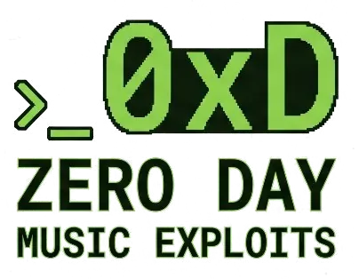
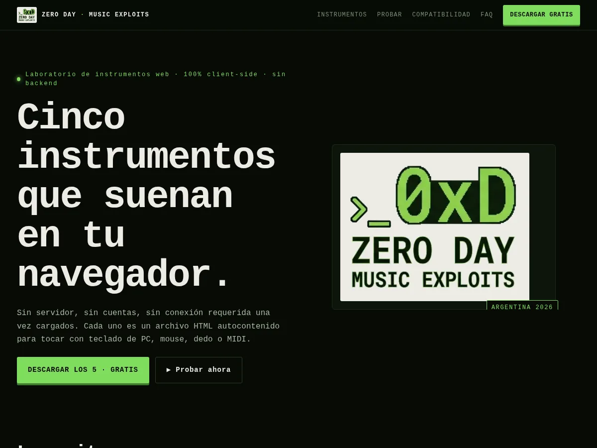
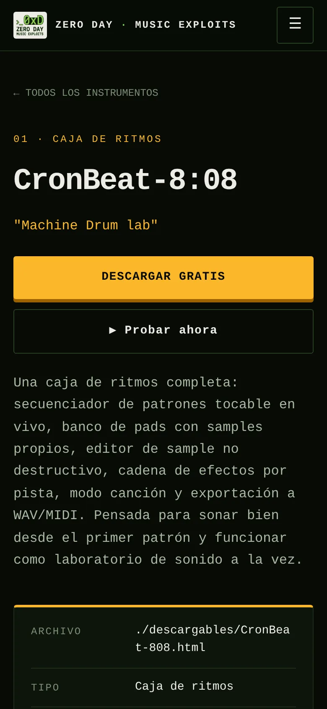
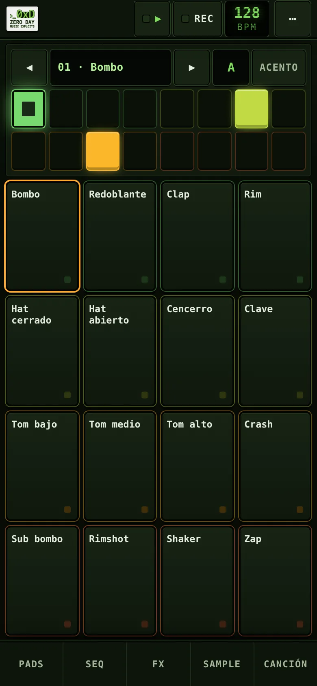
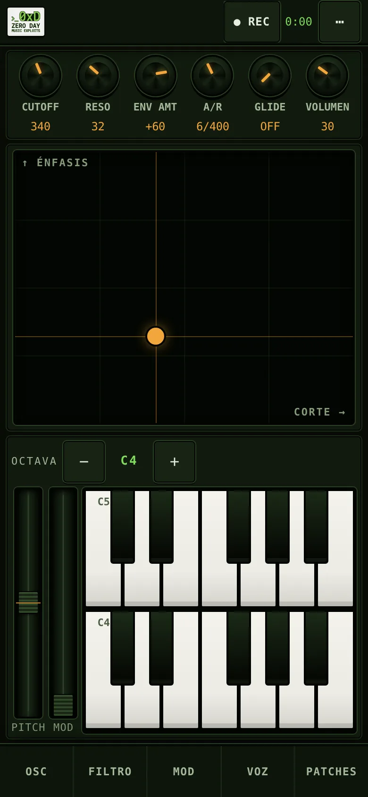
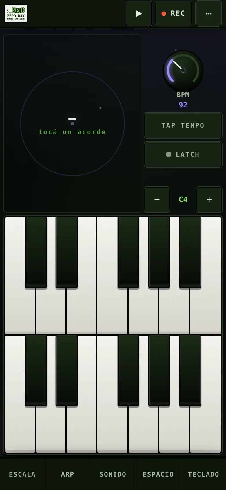
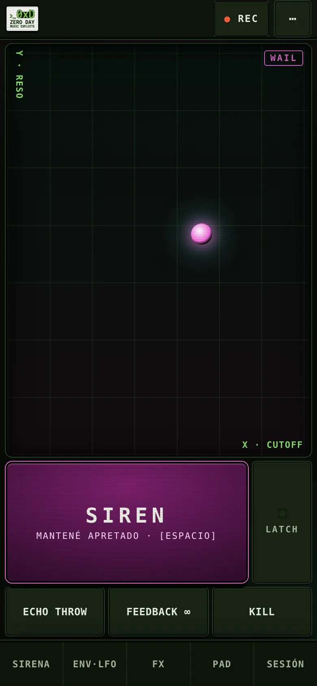
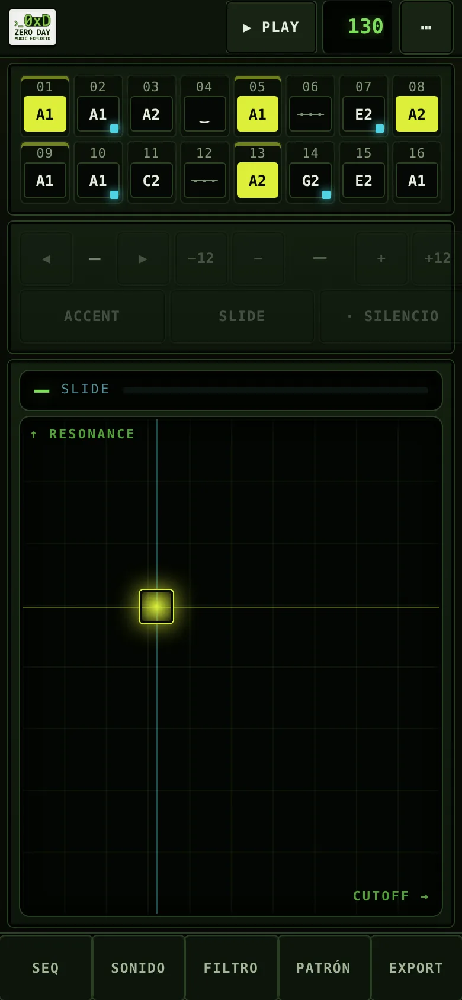

  

<h1 align="center">ZERO DAY · MUSIC EXPLOITS</h1>

<strong>Laboratorio de instrumentos web · 100% client-side · sin backend</strong>

  <a href="https://zeroday-musicexploits.github.io/instruments/">zeroday-musicexploits.github.io/instruments</a> ·
  <a href="#cómo-usar">Cómo usar</a> ·
  <a href="#compatibilidad">Compatibilidad</a> ·
  <a href="#licencia">Licencia</a>

Zero Day · Music Exploits es una suite de 5 instrumentos musicales que corren enteramente en el navegador — sin servidor, sin cuentas, sin conexión requerida una vez cargados. La forma normal de usarlos es la web: **https://zeroday-musicexploits.github.io/instruments/**. Desde ahí se puede tocar cada uno online, instalarlo como app (PWA) o descargar el HTML autocontenido para usarlo local. Cada uno está pensado para tocarse con teclado de PC, mouse, dedo (tablet/touch) o MIDI, y para funcionar como laboratorio de sonido completo: tocar, programar, grabar, exportar y guardar.

  

  

  
  
  
  
  

Los 5 instrumentos en vertical (390×844). Se regeneran con <code>node tools/build-screenshots.mjs</code>.

Los 5 instrumentos se pueden usar de forma independiente, y también se pueden sincronizar, mezclar y masterizar juntos desde **C2 · Sync Master Envelopment**, la plataforma central del proyecto (en desarrollo aparte; cada instrumento se abre ahí como una pestaña, con tempo compartido y encendido/apagado conjunto).

| # | Instrumento | Archivo | Tipo |
|---|---|---|---|
| 1 | **CronBeat-8:08** | [`descargables/CronBeat-808.html`](descargables/CronBeat-808.html) | Caja de ritmos / drum machine |
| 2 | **MonoMoon'70** | [`descargables/MonoMoon70.html`](descargables/MonoMoon70.html) | Sintetizador monofónico estilo Minimoog |
| 3 | **NEBULARP 2035** | [`descargables/Nebularp_2035.html`](descargables/Nebularp_2035.html) | Arpegiador cósmico / generativo |
| 4 | **J4-Sirens Station** | [`descargables/J4-Sirens_Station.html`](descargables/J4-Sirens_Station.html) | Dub siren psicodélica |
| 5 | **ACID BASS-303** | [`descargables/Acid_Bass-303.html`](descargables/Acid_Bass-303.html) | Bajo ácido tipo TB-303 |

## Índice

- [Cómo usar](#cómo-usar)
- [Instalar en la computadora y en el teléfono](#instalar-en-la-computadora-y-en-el-teléfono)
- [El HTML descargable](#el-html-descargable)
- [1 · CronBeat-8:08 — Caja de ritmos](#1--cronbeat-808--caja-de-ritmos)
- [2 · MonoMoon'70 — Sintetizador monofónico](#2--monomoon70--sintetizador-monofónico)
- [3 · NEBULARP 2035 — Arpegiador cósmico](#3--nebularp-2035--arpegiador-cósmico)
- [4 · J4-Sirens Station — Dub siren](#4--j4-sirens-station--dub-siren)
- [5 · ACID BASS-303 — Bajo ácido](#5--acid-bass-303--bajo-ácido)
- [C2 · Sync Master Envelopment](#c2--sync-master-envelopment)
- [Compatibilidad](#compatibilidad)
- [Privacidad](#privacidad)
- [Licencia](#licencia)
- [Soporte](#soporte)

## Cómo usar

1. **Entrá al sitio**: https://zeroday-musicexploits.github.io/instruments/. Desde "Probalo acá" podés tocar cualquiera de los 5 directo en el navegador, sin descargar nada. Con «▶ Probar» (en cada card del índice) o «▶ Probar ahora» (en la landing de cada instrumento) lo abrís a pantalla completa, en la misma pestaña; el botón «← Sitio» del instrumento vuelve al índice.
2. La primera interacción (clic, tap o tecla) desbloquea el audio del navegador — vas a ver un aviso tipo "Pulsá para encender". Es un requisito de los navegadores modernos, no un bug.
3. Si lo vas a usar seguido, instalalo desde la web como PWA (ver [abajo](#instalar-en-la-computadora-y-en-el-teléfono)) o descargá el HTML de la landing del instrumento para abrirlo sin conexión.
4. El trabajo (patrones, patches, presets, arreglos) se guarda según el instrumento — los 5 autoguardan en el navegador y restauran al volver (sin arrancar el audio); «Empezar de cero» borra la sesión. Safari puede vaciar el almacenamiento de sitios no instalados tras ~7 días sin uso, así que conviene exportar un JSON de respaldo. Para llevarte el audio afuera, los 5 exportan WAV, MIDI y JSON (en iPhone salen por Compartir).

## Instalar en la computadora y en el teléfono

**Cada instrumento se instala por separado y se abre en su propia ventana. Un HTML descargado no se instala: para instalar, abrí la versión web.**

| Sistema | Navegador | Cómo se instala |
|---|---|---|
| Windows · macOS · Linux | Chrome, Edge o Brave | Ícono de instalar en la barra de direcciones (un ⊕ o una pantalla con una flecha, según el navegador) o el botón «↓ Instalar» que aparece en el instrumento. |
| macOS | Safari 17 o más nuevo | Archivo → Agregar al Dock. |
| Windows | Firefox 143 o más nuevo | Botón «Agregar pestaña a la barra de tareas» (Add tab to taskbar) de la barra de direcciones: abre el sitio en una ventana propia, fijada a la barra de tareas. Es la función «aplicaciones web» de Firefox, no una instalación de PWA. |
| macOS · Linux | Firefox | Sin instalación de webs como app. Usá el HTML descargado: se abre con doble clic y no hace falta instalar nada. |
| Android | Chrome | Banner de instalar del instrumento, o ⋮ → Instalar app. |
| iPhone · iPad | Safari | Compartir → Agregar a inicio. Desde iOS 16.4 también se puede desde Chrome, Edge o Firefox. |

En Android, Firefox, Edge u Opera solo agregan un acceso directo que abre el sitio en el navegador; para instalar la app usá Chrome (con servicios de Google) o Samsung Internet.

Una vez instalado funciona sin conexión. Si querés los cinco, se instala cada uno.

Verificado en [MDN](https://developer.mozilla.org/en-US/docs/Web/Progressive_web_apps/Guides/Making_PWAs_installable), [caniuse](https://caniuse.com/web-app-manifest) y las [notas de Firefox 143](https://www.firefox.com/en-US/firefox/143.0/releasenotes/) (oct 2026), no asumido. MDN y caniuse dicen que Firefox no instala PWAs con manifest; lo que existe desde la 143, solo en Windows, es la función «aplicaciones web» (fijar el sitio a la barra de tareas).

La web ofrece un banner descartable y un ícono ↓ en la barra superior (en el teléfono), un botón «↓ Instalar» (en escritorio, donde el navegador lo permite) y, en navegadores embebidos (Instagram, Facebook, TikTok…), el aviso de que abras el link en Safari o Chrome. Para instalar, abrí el instrumento desde su landing o desde «▶ Probar», no el HTML descargado (ver abajo).

## El HTML descargable

Cada landing permite verificar tu mail y bajar el HTML de ese instrumento — el mismo archivo autocontenido que corre en la web, también disponible como paquete único (`descargables-zeroday.zip`) con los 5 juntos. Abrís el archivo con doble clic o arrastrándolo a una pestaña: no requiere instalación ni servidor.

**Instalá desde la web (PWA) o bajá el HTML para usarlo local. Un HTML descargado no se instala: para instalar, abrí la versión web.** Un archivo abierto en `file://` no puede registrar service worker ni manifest — los navegadores exigen `https` o `localhost` para eso. Si querés el ícono aparte y uso offline, instalalo desde la web; si solo querés el archivo para vos, bajalo y listo.

---

## 1 · CronBeat-8:08 — Caja de ritmos

*"Machine Drum lab"*

### Qué es
Una caja de ritmos completa: secuenciador de patrones tocable en vivo, banco de pads con samples propios, editor de sample no destructivo, cadena de efectos por pista, modo canción y exportación a WAV/MIDI. Pensada para sonar bien desde el primer patrón y funcionar como laboratorio de sonido a la vez.

<strong>Manual de usuario completo</strong>

### En el teléfono (vertical)
Funciona en vertical y en horizontal. En el teléfono, la barra superior lleva TOCAR/■, REC y el BPM editable, y abajo hay 5 pestañas que abren sheets.

- Zona de tocar — arriba, la pista elegida del secuenciador en 2 filas de 8 pasos; abajo, los 16 pads en 4×4. Tocar un pad lo hace sonar y elige su pista; ◀ ▶ cambian de pista sin sonar; ACENTO reemplaza al Shift.
- PADS — opciones de ejecución (velocidad por altura del dedo, note repeat 1/8·1/16·1/32) y mezcla por pad (M/S/VOL/PAN/sample).
- SEQ — patrones A–H, copiar/pegar, ↶ ↷ (deshacer/rehacer), metrónomo, aleatorio, limpiar, tempo ± / tap, swing y master.
- FX — las 4 tarjetas de efectos y los envíos por pista.
- SAMPLE — el editor de sample no destructivo.
- CANCIÓN — modo canción y archivo (JSON, abrir, MIDI, compases, WAV).
- Carril lateral — en los sheets, el borde derecho (32 px, con una barra fina que muestra la posición) no tiene controles: arrastrar ahí en vertical solo scrollea y nunca cambia un parámetro.
- Sliders de los sheets — tocar la pista no cambia el valor; el valor cambia con un arrastre horizontal (desde la perilla o desde la pista, relativo a donde estaba). Un swipe vertical encima de un slider scrollea el sheet. Doble toque en el PAN de la mezcla lo vuelve al centro.
- Menú ⋯ — ← Sitio, Instalar app y Empezar de cero.

### Pestañas principales
- **Secuenciador** — programación de patrones.
- **Pads en vivo** — tocar los pads en tiempo real (mouse, touch o teclado).
- **FX** — cadena de efectos (reverb, delay, phaser, drive) con envío por pista.
- **Editor** — editor de sample no destructivo.
- **Canción** — modo arreglo, encadenando patrones.

### Transporte y control general
- **▶ Tocar** — play/stop del patrón o la canción.
- **REC** — con el transporte sonando, tus golpes en los pads quedan grabados en el patrón.
- **BPM** (▲/▼ o flechas de teclado) y **Tap tempo** — tempo global.
- **SWING** — humaniza/desplaza los tiempos pares.
- **MASTER** — volumen general de salida.
- **Metrónomo** — click de referencia.
- **Aleatorio** — genera variación automática del patrón actual.
- **Limpiar** — vacía el patrón activo.
- **Guardar JSON / Abrir** — exporta/importa el proyecto completo (patrones, FX, samples, canción).
- **Patrón→MIDI** — exporta el patrón actual como archivo MIDI.
- **×1 / ×2 / ×4 / ×8** — cantidad de compases al exportar a WAV.
- **Exportar WAV** — renderiza el audio a archivo descargable.
- **Copiar / Pegar** (dentro de Patrón) — clona un patrón a otro slot.
- **Patrones A–H** — 8 slots de patrón, encadenables en el modo Canción.

### Editor de sample (no destructivo)
El original del sample **nunca se pisa** — todo lo que hacés ahí es reversible.
- Cargá un sample desde el Secuenciador o desde Pads en vivo, y seleccionalo en "Sample a editar".
- **▶ Escuchar** / **Revertir** / **Cargar sample…**
- **Recorte y tono:** Inicio (%), Fin (%), Tono (semitonos), Ganancia (dB).
- **Envolvente:** Ataque / fade-in (ms), Caída / fade-out (ms).
- **Normalizar** e **Invertir**.
- **Compresor** (on/off): Umbral (dB), Ratio (ej. 4:1).

### FX (por inserto/envío)
- **Reverb** (envío) — Tamaño (s), Cola, Nivel.
- **Delay** (envío) — Tiempo (ms), Repetición (feedback), Nivel.
- **Phaser** (inserto) — Velocidad (Hz), Profundidad, Realimentación.
- **Drive** (inserto) — Carácter: Overdrive / Distorsión / Fuzz, más Tono (Hz).
- **Cantidad por pista:** cada pista tiene sus propios envíos REV / DLY / PHS / DRV.

### Modo Canción
- **▶ Reproducir canción** / **Loop canción**.
- **+ Bloque** — agrega un bloque que reproduce un patrón (A–H) durante N compases, en orden.
- **Canción→MIDI** — exporta el arreglo completo a MIDI.

### Mantenimiento
- **Empezar de cero** (menú ⋯ en el teléfono; «Reiniciar proyecto» en escritorio) — borra lo autoguardado en este navegador, con confirmación.

### Teclado de PC
| Tecla | Acción |
|---|---|
| Fila de pads (varias teclas) | Tocar pads |
| `Espacio` | Tocar / parar transporte |
| `REC` (botón) | Graba tus golpes al patrón, con el transporte sonando |
| Selección de patrón | Cambia entre patrones A–H |
| `+` | Agregar bloque a la Canción |
| `←` `→` | Ajustan el tempo |
| `Shift` (al tocar un pad) | Golpe con acento |

### Guardado, exportación e instalación
- El trabajo se autoguarda en este navegador (IndexedDB) y se restaura al volver, sin arrancar el audio. «Empezar de cero» borra la sesión (pide confirmación). Safari puede vaciar el almacenamiento de sitios no instalados tras ~7 días sin uso: exportá un JSON de respaldo.
- Exportar: JSON del proyecto, MIDI del patrón o de la canción y WAV (el resultado queda en una tarjeta con escuchar y ↓ DESCARGAR WAV). En iPhone salen por Compartir.
- Instalar (desde la versión web): en la computadora, el ícono de instalar de la barra de direcciones o el botón «↓ Instalar» (Chrome, Edge, Brave), o Archivo → Agregar al Dock en Safari 17 o más nuevo; en el teléfono, el banner y el ícono ↓ de la barra superior (en iPhone y iPad, Compartir → Agregar a inicio). Cada instrumento se instala por separado y se abre en su propia ventana; una vez instalado funciona sin conexión. El HTML descargado se usa local pero no se instala.

### Estado real (export / guardado)
Exporta **WAV · MIDI · JSON**. Autoguarda en el navegador (IndexedDB, con respaldo en `localStorage`) y es instalable como PWA desde la web.

### Estado del roadmap
Fases 1 a 5 completas: modo canción, autoguardado, export JSON/WAV, editor de sample no destructivo y export/import MIDI de patrones y canciones. Versión mobile-first: layout vertical con pestañas y sheets, PWA instalable con uso sin conexión, WAV/MIDI/JSON por Compartir en iOS, deshacer/rehacer, velocidad por altura del dedo, note repeat y choke groups de hats (opcional). Sin puntos pendientes en el roadmap.

---

## 2 · MonoMoon'70 — Sintetizador monofónico

*"Monophonic Synthesizer"*

### Qué es
Un sintetizador analógico virtual monofónico estilo Minimoog: banco de osciladores, filtro escalera (ladder) de 24 dB/oct con auto-oscilación, doble envolvente, matriz de modulación, modos de voz (Mono/Unison/Duo), osciloscopio en pantalla y gestión completa de patches.

<strong>Manual de usuario completo</strong>

### En el teléfono (vertical)
Funciona en vertical y en horizontal. Arriba van REC (con tiempo y LED CLIP) y el pad XY; abajo, el teclado con las ruedas Pitch/Mod verticales al costado.

- Macros — Cutoff, Reso, Env Amt, A/R, Glide y Volumen, sincronizadas con los knobs de cada sheet. Pad XY: X = corte, Y = énfasis.
- Teclado — dos octavas; en pantallas angostas pasa a dos filas de una octava (la grave abajo). El glissando funciona entre filas.
- OSC · FILTRO · MOD · VOZ — sheets de sonido; mientras están abiertos el teclado sigue disponible para tocar.
- PATCHES — presets, biblioteca, JSON, la última toma de REC, MIDI de entrada y la ayuda del teclado de PC.
- Knobs — en los sheets, arrastre horizontal (el gesto vertical scrollea el sheet); las macros de la zona de tocar y los knobs en una ventana ancha de escritorio, arrastre vertical. Doble tap = valor de fábrica, long-press (o Enter) = valor numérico.
- Sliders de los sheets — tocar la pista no cambia el valor; el valor cambia con un arrastre horizontal (desde la perilla o desde la pista, relativo a donde estaba). Un swipe vertical encima de un slider scrollea el sheet.
- Carril lateral — en los sheets, el borde derecho (32 px, con una barra fina que muestra la posición) no tiene controles: arrastrar ahí en vertical solo scrollea y nunca cambia un parámetro.

### Encendido y cabecera
- **Pulsá para encender** — desbloquea el audio al primer toque.
- **Preset** (selector) — presets de fábrica listos para tocar.
- **Biblioteca** (selector) — tus propios patches guardados; ícono 🗑 para borrar.
- **Guardar…** — guarda el patch actual en la biblioteca del navegador.
- **⭳ JSON / ⭱ JSON** — exportar / importar un patch como archivo.
- **● Grabar** (con contador `00:00`) — graba lo que tocás y lo deja listo para exportar.
- **Conectar MIDI** — botón junto al indicador MIDI; pide el permiso de Web MIDI con un toque (no aparece en Safari ni en iOS; con el hub C2 muestra "MIDI ← C2").
- **Indicador MIDI** — muestra el estado de Web MIDI: "MIDI —", "MIDI 1", "MIDI bloqueado" o "MIDI no disponible en este navegador" (no disponible en Safari/iOS, ver [Compatibilidad](#compatibilidad)).
- **Instalar app** — PWA instalable (desde la web).

### Banco de osciladores
Mezclador de osciladores más **Ruido** (Nivel, tipo Blanco/Rosa).

### Filtro — Escalera Moog
- **Corte** (cutoff), **Énfasis** (resonancia), **Seguim.** (keyboard tracking).
- 24 dB/oct, con **resonancia hasta auto-oscilación** (el filtro puede sonar como un oscilador propio al máximo).

### Amplitud — Contorno y salida
- Envolvente ADSR: **Ataque, Caída, Sostén, Relaj.**
- **Volumen** general y **Afinación** (tuning) del instrumento.

### Modulación
- Fuente: mezcla de **Osc3 · Ruido**.
- **Osc3 → teclado** (si el oscilador 3 sigue o no el teclado).
- **Mod → Osciladores** / **Mod → Filtro** (destinos de la modulación).
- Truco clásico: poné Osc3 en rango **LO** y sin seguimiento de teclado para que actúe como **LFO**, combinado con Ruido. La profundidad se controla con la **rueda Mod**.
- Con **Mod → Filtro** y el Osc3 a frecuencia de audio (rangos 8', 4' o 2') el filtro puede saturarse y sonar un zumbido fuerte; para modular el corte usá el Osc3 en **LO** (como LFO). Ya no se queda mudo hasta recargar: el filtro se reinicia solo y la realimentación está saturada (cambio de timbre mínimo en resonancias altas).

### Contorno de filtro (2ª envolvente)
- **Cantidad, Ataque, Caída, Sostén, Relaj.**
- Esta envolvente barre el corte del filtro en octavas. **Cantidad negativa** cierra el filtro en vez de abrirlo.

### Voz
- **Mono** / **Unison** (voces detuneadas apiladas, con control de **Detune unison**) / **Duo** (tocás 2 teclas y suena el intervalo: osc1 = voz aguda, osc2/3 = voz grave).

### Osciloscopio
Visualización en tiempo real de la forma de onda de salida.

### Controladores
- **Glide** (portamento).
- **Disparo:** Single / Multi (retrigger de la envolvente en legato).
- **Rueda Pitch** → bend de hasta ±2 semitonos, vuelve al centro al soltar.
- **Rueda Mod** → profundidad de toda la matriz de modulación.
- **Octava** (`−` / `C4` / `+`).

### Teclado de PC
| Tecla | Acción |
|---|---|
| `A S D F G H J K L Ñ` | Teclas blancas |
| `W E T Y U O P` | Teclas negras |
| Mouse / dedos | Tocar directamente sobre el teclado en pantalla; deslizar = glissando |
| `Z` / `X` | Bajar / subir octava |
| `Espacio` | Pánico (corta todas las notas sonando) |

### Guardado, exportación e instalación
- El patch en edición y la biblioteca se autoguardan en este navegador. La biblioteca anterior (hackwave-minimoog) se migra sola y la vieja queda intacta. «Empezar de cero» vuelve al patch de fábrica (pide confirmación). Exportá un JSON de respaldo: Safari puede vaciar el almacenamiento de sitios no instalados.
- Exportar: JSON (patch + biblioteca), MIDI y WAV de la toma de REC. En iPhone salen por Compartir.
- Instalar (desde la versión web): en la computadora, el ícono de instalar de la barra de direcciones o el botón «↓ Instalar» (Chrome, Edge, Brave), o Archivo → Agregar al Dock en Safari 17 o más nuevo; en el teléfono, el banner y el ícono ↓ de la barra superior (en iPhone y iPad, Compartir → Agregar a inicio). Cada instrumento se instala por separado y se abre en su propia ventana; una vez instalado funciona sin conexión. El HTML descargado se usa local pero no se instala.

### Estado real (export / guardado)
Exporta **WAV · MIDI · JSON**. Autoguarda en el navegador (IndexedDB, con respaldo en `localStorage`) y es instalable como PWA desde la web.

### Estado del roadmap
Fases 1 a 4 completas: motor de síntesis monofónico + teclado táctil con glissando, ruedas Pitch/Mod y glide (F1–F2); contorno de filtro, matriz de modulación, unison/duo y osciloscopio (F3); presets, biblioteca local, Web MIDI y PWA (F4). Versión mobile-first: layout vertical con 6 macros, pad XY y sheets, autoguardado del patch y de la biblioteca, REC → WAV y MIDI de la toma (notas, pitch bend, CC1, CC74/CC71) y JSON completo. Roadmap cerrado.

---

## 3 · NEBULARP 2035 — Arpegiador cósmico

*"motor dormido" hasta que tocás un acorde*

### Qué es
Un arpegiador ambiental y generativo: sostenés (o dejás en Latch) un acorde y el instrumento lo recorre solo, con una voz cósmica en unísono, espacio (reverb + delay ping-pong), modulación (chorus + auto-paneo) y una capa de drone grave. Todo cuantizado a una escala mística elegida.

<strong>Manual de usuario completo</strong>

### En el teléfono (vertical)
Funciona en vertical y en horizontal. Arriba, el orbit y una columna con BPM, tap y latch; abajo, el piano multitáctil (en pantallas angostas, dos filas de una octava). La barra superior lleva PLAY y REC.

- ESCALA · ARP · SONIDO · ESPACIO — sheets de ajuste; con ellos abiertos el piano, el latch y la octava siguen a mano para tocar.
- TECLADO — panel Sesión: última toma de REC, guardar/abrir JSON, Empezar de cero, modo liviano del visualizador y ayuda del teclado de PC.
- Knobs — en los sheets, arrastre horizontal (el gesto vertical scrollea el sheet) o el slider de la fila; el BPM de la zona de tocar y los knobs en una ventana ancha de escritorio, arrastre vertical. Doble tap = reset, long-press (o Enter) = valor numérico.
- Sliders de los sheets — tocar la pista no cambia el valor; el valor cambia con un arrastre horizontal (desde la perilla o desde la pista, relativo a donde estaba). Un swipe vertical encima de un slider scrollea el sheet.
- Carril lateral — en los sheets, el borde derecho (32 px, con una barra fina que muestra la posición) no tiene controles: arrastrar ahí en vertical solo scrollea y nunca cambia un parámetro.
- Menú ⋯ — ← Sitio, Instalar app, guardar/abrir sesión (JSON) y Empezar de cero.

### Arranque
- Estado inicial: **"motor dormido — tocá un acorde"**.
- **Iniciar** — arranca el motor de audio.
- **Tap tempo** — define el tempo del arpegio a golpes.
- **Latch** — el acorde sostenido queda sonando manos libres; tocar uno nuevo lo reemplaza.
- Se toca con **mouse o dedo**; arrastrar = glissando; **multitáctil** = acordes con varios dedos a la vez.

### Escala mística
- **Escala** y **Tónica** (root) — todo lo que tocás se cuantiza para sonar siempre dentro del clima elegido.

### Arpegiador
- **Patrón** (orden en que se recorren las notas sostenidas).
- **Subdivisión** (velocidad rítmica del recorrido).
- **Rango de octavas** (cuánto se extiende hacia arriba/abajo).
- **Movimiento** (cómo evoluciona el recorrido en el tiempo).
- **Ritmo euclidiano (Euclid)** — activable, con contador propio para generar patrones rítmicos matemáticos en vez de un recorrido continuo.

### Pad
Envolvente y filtro base de cada voz — el carácter "cósmico" se termina de armar en los paneles de abajo.

### Voz cósmica
Unísono: varios osciladores desafinados entre sí y esparcidos en estéreo, más un barrido de filtro maestro.

### Espacio
Reverb amplia + delay ping-pong: la profundidad y el "eco galáctico" del sonido.

### Modulación
Chorus + auto-paneo: anchura estéreo y movimiento que evolucionan solos, sin intervención manual constante.

### Drone
Capa grave sostenida en la tónica — el colchón de fondo, que sigue automáticamente a la **Escala** elegida.

### Notas sostenidas
Panel que muestra en vivo qué notas está recorriendo el arpegiador en este momento (vacío cuando no hay nada sostenido).

### Teclado de PC
Mismo mapeo estilo piano que MonoMoon'70.

| Tecla | Acción |
|---|---|
| Teclado tipo piano (igual que MonoMoon'70) | Tocar notas / acordes |
| `Z` | Bajar octava |
| `X` | Subir octava |
| `−` / `C4` / `+` | Selector de octava base |
| `Espacio` | Play / Stop del transporte |

**Comportamiento según transporte:**
- Con el transporte **detenido**, las teclas suenan como un pad sostenido (para probar sonido).
- Con el transporte **en marcha**, sostener un acorde hace que el arpegiador lo recorra automáticamente.
- Con **Latch** activo, el acorde queda sonando solo, manos libres, hasta tocar uno nuevo.

### REC y exportación
- ● REC (barra superior) — graba la salida en vivo; al cortar, la toma ofrece escuchar, ↓ DESCARGAR WAV y el MIDI de las notas de esa toma (con el tempo del momento).
- JSON — la sesión completa (escala, arpegio, sonido, espacio, drone y acorde latcheado), con validación al abrir.
- En iPhone, los archivos salen por Compartir.

### Autoplay generativo
- Autoplay — el instrumento toca solo; tocar una tecla o detener el transporte lo apaga. No se guarda en la sesión.

### Guardado, modo liviano e instalación
- El trabajo se autoguarda en este navegador (IndexedDB) y se restaura al volver, sin arrancar el audio. «Empezar de cero» borra la sesión (pide confirmación). Safari puede vaciar el almacenamiento de sitios no instalados tras ~7 días sin uso: exportá un JSON de respaldo.
- Modo liviano — el visualizador dibuja menos (se fuerza con «reducir movimiento» del sistema); es una preferencia del dispositivo.
- Instalar (desde la versión web): en la computadora, el ícono de instalar de la barra de direcciones o el botón «↓ Instalar» (Chrome, Edge, Brave), o Archivo → Agregar al Dock en Safari 17 o más nuevo; en el teléfono, el banner y el ícono ↓ de la barra superior (en iPhone y iPad, Compartir → Agregar a inicio). Cada instrumento se instala por separado y se abre en su propia ventana; una vez instalado funciona sin conexión. El HTML descargado se usa local pero no se instala.

### Estado real (export / guardado)
Exporta **WAV · MIDI · JSON**. Autoguarda en el navegador (IndexedDB, con respaldo en `localStorage`) y es instalable como PWA desde la web.

### Estado del roadmap
Planificación y desarrollo base completos (100% client-side, como CronBeat-8:08 y MonoMoon'70). Versión mobile-first: layout vertical con orbit, piano multitáctil y sheets, autoguardado de la sesión, REC → WAV, MIDI de las notas del arpegio, JSON completo, PWA instalable con uso sin conexión y autoplay generativo.

---

## 4 · J4-Sirens Station — Dub siren

*Dub siren web psicodélica*

### Qué es
Una sirena dub completa: motor de síntesis con varios modos, cadena de efectos dub (tape echo, reverb spring/plate, phaser), un pad X-Y para performance en vivo, visualizador psicodélico en pantalla completa, y banco de presets con export/import JSON.

<strong>Manual de usuario completo</strong>

### En el teléfono (vertical)
Funciona en vertical y en horizontal. El pad XY ocupa gran parte de la pantalla y, debajo, el deck de performance al alcance del pulgar: una fila de arriba con SIREN grande (mantener), LATCH, MUTE y BURNOUT y, debajo, los throws (ECHO THROW, FEEDBACK ∞ y KILL).

- SIRENA · ENV·LFO · FX · PAD — sheets de ajuste; mientras están abiertos quedan el pad, una fila con SIREN, MUTE y BURNOUT y otra con los throws para tocar.
- PAD — ejes del pad, teclado de notas (en el teléfono, 4 filas de 5 en cuartas) y opciones del visualizador.
- SESIÓN — grabación (REC), patches y archivos.
- Perillas — en los sheets, arrastre horizontal: el gesto vertical scrollea el sheet; en una ventana ancha de escritorio, arrastre vertical. Doble tap = valor por defecto, long-press (o Enter) = valor numérico.
- Sliders de los sheets — tocar la pista no cambia el valor; el valor cambia con un arrastre horizontal (desde la perilla o desde la pista, relativo a donde estaba). Un swipe vertical encima de un slider scrollea el sheet.
- Carril lateral — en los sheets, el borde derecho (32 px, con una barra fina que muestra la posición) no tiene controles: arrastrar ahí en vertical solo scrollea y nunca cambia un parámetro.
- Menú ⋯ — ← Sitio, Instalar app y Empezar de cero.

### Encendido
**Tocá para encender** — activa el audio; subí un poco el volumen del sistema al empezar.

### Motor de sirena
- **WAIL** (fase 1) — modo de sirena activo.
- **CH-A** — lectura en Hz de la frecuencia actual del canal.
- **Ampliar** — expande el visualizador.
- **Modo de sirena** (selector) — distintos comportamientos de barrido/oscilación.

### Oscilador · Filtro · Movimiento
- **Forma de onda** del oscilador.
- **Shape del movimiento** — la curva con la que se mueve la sirena (barrido, salto, etc.).

### Envolvente · Glide · Salida
Controla el ataque/liberación del sonido y el portamento entre notas/frecuencias.

### Modulación — 2 LFO
Dos LFOs independientes para modular parámetros del motor.

### Cadena de efectos dub
- **Tape Echo** — delay a cinta, con eco repetible.
- **Spring/Plate Reverb** — reverb de resorte o placa, con **Carácter** ajustable.
- **Phaser Dub**.
- (De fábrica: **echo throw** / **feedback infinito** / **kill switches** para los cortes clásicos de dub en vivo.)

### Reposo y eco
En reposo (encendido y sin tocar nada) J4 queda en silencio exacto. Y el eco se apaga solo: la cola decae hasta desaparecer.

- **Techo del eco** — la ganancia del lazo del eco tiene un techo que depende del TIME: `L = min(0,97 ; 10^(−1,8·TIME/20))`, que con el TIME de fábrica (0,38 s) es 0,924. La perilla FEEDBACK llega hasta ese techo; hasta ~25 % de la perilla suena igual que antes.
- **FEEDBACK ∞** — sigue autooscilando a propósito; al soltarlo la cola se apaga.
- **Cuánto tarda en apagarse** — tiempo medido para bajar de −60 dBFS tras mantener SIREN 1 s y soltar: fábrica 9,1 s · Classic Wail 11,4 s · Police Alarm 7,8 s · Acid Scream 7,2 s · UFO Random 15,8 s · Cosmic Drone 18,0 s · Feedback Dub 16,0 s.
- En Feedback Dub el eco desbocado ahora solo sale con ∞.

### Pad X-Y
Pad táctil asignable: **Eje X** y **Eje Y** se pueden mapear a distintos parámetros del motor para tocar en vivo con un dedo.

### Disparo
- **SIREN** — botón de disparo; **mantené apretado** para sostener el sonido.
- `[ESPACIO]` — mismo disparo desde el teclado.

### MUTE, BURNOUT y KILL
Tres maneras de cortar el sonido, cada una con un alcance distinto.

- **KILL** (tecla `8`, mientras se mantiene) — corta solo la sirena directa y los ecos; la reverb y las colas siguen sonando.
- **MUTE** (tecla `9`, mientras se mantiene) — silencia toda la salida. El eco y la reverb siguen por dentro, así que al soltar se oyen sus colas.
- **BURNOUT** (tecla `0`; un toque lo enciende y otro lo apaga) — silencio total: corta la sirena (también en LATCH), FEEDBACK ∞ y ECHO THROW, y vacía las colas del eco y la reverb, así que al volver no queda ninguna cola.
- Con BURNOUT encendido, el pad avisa «BURNOUT · SILENCIO TOTAL — tocá BURNOUT para volver».
- BURNOUT no se guarda: al abrir el instrumento, siempre suena.
- REC y el hub C2 reciben el silencio de MUTE y de BURNOUT: lo que cortás queda así en la toma.
- ECHO THROW (tecla `1`), FEEDBACK ∞ (tecla `4`) y KILL (tecla `8`) son momentáneos: valen mientras se mantienen.

### Patches · Presets
- **Banco de fábrica** — 6 presets de fábrica: Classic Wail, Police Alarm, Acid Scream, UFO Random, Cosmic Drone y Feedback Dub.
- **Guardar en este navegador**.
- **Exportar / Importar JSON** — Exportar, Copiar (al portapapeles), Importar archivo, Aplicar JSON.

### Teclado de PC
Mapeo de 2 octavas y teclas de performance.

| Tecla | Acción |
|---|---|
| `Z S X D C …` | Primera octava |
| `Q 2 W …` | Segunda octava |
| `[ESPACIO]` | Disparo de sirena (mantener apretado) |
| `1` | ECHO THROW (mientras se mantiene) |
| `4` | FEEDBACK ∞ (mientras se mantiene) |
| `8` | KILL (mientras se mantiene) |
| `9` | MUTE (mientras se mantiene) |
| `0` | BURNOUT (un toque lo enciende y otro lo apaga) |

### Extras de la última fase
- **Ring modulator**.
- **Bitcrusher** (vía AudioWorklet, con fallback para navegadores sin soporte).
- **Drift** extra de tono en modo Drone.
- Visualizador **CRT / psicodélico**: osciloscopio, Lissajous y mandala, con pantalla completa.

### REC y exportación
- ● REC — graba la salida en vivo (WAV 16-bit estéreo, hasta 10 min). ■ cierra la toma y aparece la tarjeta con escuchar, ↓ DESCARGAR WAV y ↓ MIDI DE LA TOMA (notas, pitch bend ±24 st, CC74/CC71 del pad).
- JSON — el estado completo más tus patches guardados (sirve de respaldo); también abre los dubsiren-patch.json de versiones anteriores.
- En iPhone, los archivos salen por Compartir.

### Guardado, visualizador e instalación
- El trabajo se autoguarda en este navegador (IndexedDB) y se restaura al volver, sin arrancar el audio. «Empezar de cero» borra la sesión (pide confirmación). Safari puede vaciar el almacenamiento de sitios no instalados tras ~7 días sin uso: exportá un JSON de respaldo. Los patches guardados van aparte y no los borra «Empezar de cero».
- Visualizador: VISUAL ON/OFF y BAJA CARGA (~20 fps, sin glow); «reducir movimiento» del sistema lo deja en una línea fija.
- Instalar (desde la versión web): en la computadora, el ícono de instalar de la barra de direcciones o el botón «↓ Instalar» (Chrome, Edge, Brave), o Archivo → Agregar al Dock en Safari 17 o más nuevo; en el teléfono, el banner y el ícono ↓ de la barra superior (en iPhone y iPad, Compartir → Agregar a inicio). Cada instrumento se instala por separado y se abre en su propia ventana; una vez instalado funciona sin conexión. El HTML descargado se usa local pero no se instala.

### Estado real (export / guardado)
Exporta **WAV · MIDI · JSON**. Autoguarda en el navegador (IndexedDB, con respaldo en `localStorage`) y es instalable como PWA desde la web.

### Estado del roadmap
4 fases completas: F1 motor + 5 modos + filtro resonante + teclado PC/touch · F2 cadena dub (tape echo, reverb spring/plate, phaser, echo throw/feedback infinito/kill) · F3 pad X-Y, visualizador psicodélico y presets · F4 ring modulator, bitcrusher, drift en Drone y banco de fábrica de 6 presets. Versión mobile-first: layout vertical con pad XY protagonista, deck de performance con hold/latch, sheets, autoguardado del estado actual, REC → WAV, MIDI de performance, JSON completo, visualizador de baja carga y PWA instalable con uso sin conexión.

---

## 5 · ACID BASS-303 — Bajo ácido

*"Sub-Zero Edition"*

### Qué es
Un bajo ácido tipo TB-303 modernizado: secuenciador clásico de 16 pasos con note/accent/slide/gate, filtro resonante con distorsión, generador de patrones por escala, pad X-Y de performance en vivo, y patches con export a JSON/MIDI/WAV.

<strong>Manual de usuario completo</strong>

### En el teléfono (vertical)
Funciona en vertical y en horizontal. Arriba, los 16 pasos en 2 filas de 8 con el editor del paso (nota/accent/slide/gate) y el pad XY siempre visible; abajo, 5 pestañas que abren sheets.

- SEQ — secuenciador, tempo y teclado.
- SONIDO y FILTRO — oscilador, distorsión y filtro resonante; mientras están abiertos el pad XY y los pasos siguen disponibles.
- PATRÓN — generador de patrones y banco de fábrica.
- EXPORT — patches (JSON), MIDI y WAV.
- Knobs — en los sheets (TEMPO incluido), arrastre horizontal: el gesto vertical scrollea el sheet; en una ventana ancha de escritorio, arrastre vertical. Doble tap = reset, long-press (o Enter) = valor numérico.
- Sliders de los sheets — tocar la pista no cambia el valor; el valor cambia con un arrastre horizontal (desde la perilla o desde la pista, relativo a donde estaba). Un swipe vertical encima de un slider scrollea el sheet.
- Carril lateral — en los sheets, el borde derecho (32 px, con una barra fina que muestra la posición) no tiene controles: arrastrar ahí en vertical solo scrollea y nunca cambia un parámetro.
- Menú ⋯ — ← Sitio, Instalar app y Empezar de cero.

### Encendido y transporte
- **▶ PLAY** — arranca el secuenciador.
- **TAP** — tap tempo.

### Performance · Live tweak (pad X-Y)
El gesto acid clásico: arrastrá con el dedo mientras suena — **X = Cutoff**, **Y = Resonance**.
- **Nota en curso** — muestra la nota que está sonando.
- **SLIDE** — indicador de ligado entre pasos.

### Oscilador
- **Forma de onda:** ◺ SAW · ⊓ SQR (cuadrada) · △ TRI (triangular) · ⊔ PULSE.
- **SUB:** −1 OCT / −2 OCT (oscilador sub una o dos octavas abajo).

### Filtro resonante
- **Modo:** LP 18dB (pasabajos) / BP (pasabanda) / HP (pasaaltos).
- **Distorsión multietapa** — saturación en cascada sobre la señal filtrada.

### Secuenciador · 16 pasos
- **Patrón** — grilla de 16 pasos con nota/acento/slide/gate por paso.
- **OCT** (`−` / `0` / `+`) — transporte de octava del patrón.
- **SWING** — humaniza el groove.
- **INIT ACID** — resetea a un patrón acid básico.
- **CLEAR** — vacía el patrón.

### Generador de patrones
- **Escalas:** Menor, Frigio, Pentatónica, Cromática.
- **Densidad** — cuántos pasos tienen nota activa (ej. 70%).
- **⚡ RANDOM** — genera un patrón nuevo al azar dentro de la escala/densidad elegidas.
- **✦ MUTAR** — muta ligeramente el patrón actual, sin regenerarlo desde cero.

### Patches · Banco · Export
- **⭳ Guardar JSON** / **⭱ Cargar JSON** — patch completo.
- **♪ Exportar MIDI** — el patrón como archivo MIDI.
- **WAV:** elegí 1 / 2 / 4 compases y **◉ Exportar WAV** para renderizar el audio.
- **Banco de fábrica** — 8 patrones acid genéricos de referencia.

### Teclado · Tocar / Programar
- Tocá para escuchar libremente.
- Con un **paso seleccionado** en el secuenciador (tocando su nota), la tecla del teclado **programa esa nota** en ese paso.

| Tecla | Acción |
|---|---|
| `A W S E D F T G Y H U J K` | Notas (mapeo tipo piano) |
| `Z` / `X` | Octava del teclado (`−` / `+`) |
| `Espacio` | Play / Stop |

### Guardado e instalación
- Patrón, parámetros, banco de usuario, tempo y swing se autoguardan en este navegador y se restauran al volver, sin arrancar el audio. «Empezar de cero» lo borra (pide confirmación). Exportá un JSON de respaldo: Safari puede vaciar el almacenamiento de sitios no instalados.
- Instalar (desde la versión web): en la computadora, el ícono de instalar de la barra de direcciones o el botón «↓ Instalar» (Chrome, Edge, Brave), o Archivo → Agregar al Dock en Safari 17 o más nuevo; en el teléfono, el banner y el ícono ↓ de la barra superior (en iPhone y iPad, Compartir → Agregar a inicio). Cada instrumento se instala por separado y se abre en su propia ventana; una vez instalado funciona sin conexión. El HTML descargado se usa local pero no se instala.

### Estado real (export / guardado)
Exporta **WAV · MIDI · JSON**. Autoguarda en el navegador (IndexedDB, con respaldo en `localStorage`) y es instalable como PWA desde la web.

### Estado del roadmap
4 fases completas: F1 motor de síntesis + secuenciador clásico de 16 pasos · F2 modernización: ondas extra, filtro HP/BP, unísono, distorsión multietapa, swing, generador de patrones · F3 touch/tablet y performance en vivo (knobs arrastrables, live tweak vía pad X-Y) · F4 patches y banco de fábrica (JSON, MIDI y WAV, 8 patrones). Versión mobile-first: layout vertical con pestañas y sheets, autoguardado, PWA instalable con uso sin conexión y exportación por Compartir en iOS.

---

## C2 · Sync Master Envelopment

Plataforma central de Zero Day · Music Exploits que integra los 5 instrumentos de arriba como pestañas dentro de una misma sesión, con **tempo sincronizado** y **encendido/apagado conjunto**, pensada para sincronizar, mezclar y masterizar lo que cada instrumento produce. Es un proyecto propio, en desarrollo aparte — este README cubre el manual de usuario de los 5 instrumentos individuales.

---

**Descarga con verificación de mail.** El formulario valida el formato, detecta errores de tipeo comunes (`gmial.com`), rechaza mails temporales y consulta que el dominio reciba correo (contra `dns.google`). Después "envía" un código de 6 dígitos que vence a los 10 minutos. Una vez verificado, el mail queda recordado en ese navegador (`localStorage`) para descargar desde cualquier landing sin repetir el paso.

> **Envío del código.** Hoy el sitio corre en **modo demo**: sin un servicio de mail conectado, el código se muestra en pantalla en vez de enviarse. Para mandarlo de verdad hay que definir `window.ZD_SEND_CODE(email, code)` con un servicio como EmailJS, Resend o Brevo. Como la verificación corre en el navegador, para una protección real el código y los archivos deberían servirse desde un backend.

---

## Compatibilidad

Verificado en [MDN](https://developer.mozilla.org/) y [caniuse.com](https://caniuse.com/) — no asumido.

| Navegador | Sistema | Audio (Web Audio API) | Web MIDI |
|---|---|---|---|
| Chrome / Edge | Windows, macOS, Linux | Sí | Sí |
| Firefox | Windows, macOS, Linux | Sí | Sí (desde Firefox 108) |
| Safari | macOS | Sí | No |
| Chrome | Android | Sí | Sí |
| Safari | iOS / iPadOS | Sí | No |
| Cualquier navegador en iOS (Chrome, Firefox…) | iOS / iPadOS | Sí | No |

**Web MIDI no existe en Safari ni en ningún navegador de iOS** (ahí todos corren sobre WebKit, con o sin el nombre Safari puesto): MonoMoon'70 detecta la ausencia de `navigator.requestMIDIAccess` y lo indica en pantalla en vez de fallar en silencio. El resto de la suite (Web Audio API) funciona en los seis.

## Privacidad

Los instrumentos no envían nada a ningún servidor: todo lo que hacés queda en tu navegador. El sitio pide un mail para la descarga (hoy en modo demo, ver arriba) y mide visitas de forma agregada con Google Analytics — nunca en los instrumentos. Detalle completo en [`privacidad.html`](https://zeroday-musicexploits.github.io/instruments/privacidad.html).

## Licencia

[CC BY-NC 4.0](LICENSE) — atribución, no comercial. Ver [`LICENSE`](LICENSE) para el detalle (incluye una nota pendiente de confirmar con el titular del proyecto).

## Soporte

¿Encontraste un bug o te falta algo? [Abrí un issue en el repo](https://github.com/ZeroDay-MusicExploits/instruments/issues).

<!-- TODO: sumar un canal de contacto directo (mail/formulario) cuando el titular defina uno -->

---

ZERO DAY · MUSIC EXPLOITS · Argentina 2026

